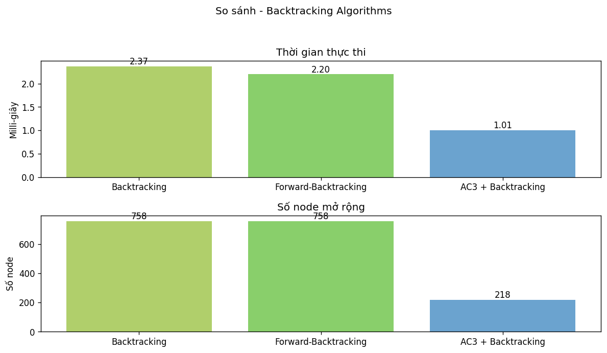

# AI_Assignment

# Báo cáo Đồ án Cá nhân Trí tuệ Nhân tạo

## Đề tài: Giải bài toán **8-Queens (8 quân hậu)** bằng các thuật toán tìm kiếm

Giảng viên hướng dẫn: **TS. Phan Thị Huyền Trang**  
Sinh viên thực hiện: **Nguyễn Hoàng Giáp – 23110096**  
Ngày báo cáo: *Tháng 10 năm 2025 (Học Kì I)*  

---

## 1. Mục tiêu

Mục tiêu của dự án là xây dựng một **ứng dụng mô phỏng trực quan** việc giải bài toán **8-Queens** (đặt 8 quân hậu trên bàn cờ 8×8 sao cho không quân nào tấn công nhau) bằng cách áp dụng và **so sánh hiệu quả** của nhiều **thuật toán tìm kiếm** trong Trí tuệ Nhân tạo (AI).

Ứng dụng cung cấp giao diện Tkinter để:

* Chọn thuật toán và **quan sát quá trình đặt hậu từng bước** (animate).
* Xem **log chi tiết** (đường đi, chi phí/heuristic, xác suất chấp nhận, tiến hoá…).
* **So sánh** hành vi giữa các nhóm thuật toán (blind, informed, local, đặc biệt).

**Mô hình hoá bài toán:**

* **Trạng thái (State):** Một bàn cờ 8×8, biểu diễn bằng ma trận 0/1 (1 là vị trí có hậu).
* **Hành động (Action):** Đặt một hậu vào một ô hợp lệ ở hàng hiện tại.
* **Môi trường (Environment):** Tập hợp tất cả các trạng thái có thể đạt được từ trạng thái ban đầu bằng cách áp dụng các hành động thỏa ràng buộc.
* **Ràng buộc:** Không có 2 hậu nào cùng hàng, cùng cột, hoặc cùng đường chéo.
* **Trạng thái đích (Goal):** Đặt đủ 8 hậu thoả ràng buộc và **phải thỏa bàn cờ đích** (là bàn cờ bên phải).
* **Chi phí (Step Cost):** Chi phí để thực hiện một hành động.

---

## 3.1 Giới thiệu về Trí tuệ Nhân tạo và các loại thuật toán tìm kiếm

**Trí tuệ nhân tạo (Artificial Intelligence - AI)** là ngành khoa học và kỹ thuật phát triển hệ thống máy tính có khả năng **tự học, nhận thức, phán đoán và xử lý thông tin** như con người. Một trong những nội dung cốt lõi của AI là **tìm kiếm trong không gian trạng thái**, giúp máy tính tìm lời giải cho các bài toán phức tạp.

### Phân loại các phương pháp tìm kiếm

* **Tìm kiếm không có thông tin (Uninformed Search):** Không sử dụng thông tin bổ sung ngoài cấu trúc bài toán. Ví dụ: BFS, DFS.
* **Tìm kiếm có thông tin (Informed Search):** Sử dụng hàm heuristic h(n) để ước lượng khoảng cách đến đích, giúp giảm không gian tìm kiếm. Ví dụ: A*.
* **Tìm kiếm cục bộ (Local Search):** Dựa trên cải thiện dần một lời giải hiện tại mà không xây dựng toàn bộ cây tìm kiếm. Ví dụ: Hill-Climbing, Simulated Annealing.
* **Tìm kiếm có ràng buộc (Constraint Satisfaction):** Gán giá trị cho các biến sao cho thoả tất cả các ràng buộc. Ví dụ: Backtracking, AC-3.
* **Tìm kiếm trong môi trường phức tạp:** Làm việc trong môi trường không chắc chắn, dùng các chiến lược như AND–OR Search hay Belief-State Search.

---

## 2. Nội dung

### 2.1. Các thuật toán **Tìm kiếm không có thông tin** (Uninformed / Blind Search)

**Khái niệm:** Không dùng heuristic, chỉ dựa vào cấu trúc cây tìm kiếm.

#### **BFS (Breadth-First Search)**

* **Mô tả:** Duyệt theo tầng, mở rộng các nút ở cùng độ sâu trước khi sang tầng kế tiếp.
* **Độ phức tạp:** Thời gian O(b^d), không gian O(b^d).
* **Ưu điểm:** Luôn tìm được lời giải ngắn nhất (nếu tồn tại).
* **Nhược điểm:** Tiêu tốn bộ nhớ lớn.

<p align="center">
  
  <br><em>Hình minh họa thuật toán BFS</em>
</p>

#### **DFS (Depth-First Search)**

* **Mô tả:** Duyệt sâu theo từng nhánh đến tận cùng, sau đó quay lui.
* **Độ phức tạp:** Thời gian O(b^m), không gian O(b·m).
* **Ưu điểm:** Tiết kiệm bộ nhớ, đơn giản.
* **Nhược điểm:** Dễ rơi vào vòng lặp, không đảm bảo tối ưu.

<p align="center">
  
  <br><em>Hình minh họa thuật toán DFS</em>
</p>

#### **DLS / IDS (Depth-Limited / Iterative Deepening Search)**

* **Mô tả:** DLS đặt giới hạn độ sâu, IDS lặp lại quá trình tăng dần giới hạn.
* **Độ phức tạp:** Thời gian O(b^d), không gian O(b·d).
* **Ưu điểm:** Kết hợp ưu điểm của BFS và DFS.
* **Nhược điểm:** Phải lặp lại nhiều lần các tầng nông.

<p align="center">
  
  <br><em>Hình minh họa thuật toán IDS</em>
</p>

<p align="center">
  
  <br><em>Biểu đồ so sánh hiệu suất nhóm Uninformed</em>
</p>

---

### 2.2. Các thuật toán **Tìm kiếm có thông tin** (Informed Search)

**Khái niệm:** Sử dụng hàm heuristic h(n) để ước lượng khoảng cách tới đích.

#### **Uniform-Cost Search (UCS)**

* **Mô tả:** Mở rộng nút có chi phí tích lũy g(n) nhỏ nhất.
* **Ưu điểm:** Đảm bảo tối ưu nếu chi phí không âm.
* **Nhược điểm:** Chậm khi nhiều đường có chi phí tương tự.

<p align="center">
  
  <br><em>Hình minh họa thuật toán UCS</em>
</p>

#### **Greedy Best-First Search**

* **Mô tả:** Chọn mở rộng nút có heuristic h(n) nhỏ nhất, bỏ qua g(n).
* **Ưu điểm:** Nhanh trong nhiều trường hợp.
* **Nhược điểm:** Dễ kẹt ở cực trị cục bộ.

<p align="center">
  
  <br><em>Hình minh họa thuật toán Greedy</em>
</p>

#### **A***

* **Mô tả:** Kết hợp chi phí thực tế và heuristic: f(n) = g(n) + h(n).
* **Ưu điểm:** Khi h(n) là admissible, A* đảm bảo tối ưu.
* **Nhược điểm:** Tốn nhiều bộ nhớ.

<p align="center">
  
  <br><em>Hình minh họa thuật toán A*</em>
</p>

<p align="center">
  
  <br><em>Biểu đồ so sánh hiệu suất nhóm Informed</em>
</p>

---

### 2.3. **Tìm kiếm cục bộ** (Local Search)

**Khái niệm:** Làm việc trên một cấu hình đầy đủ và cải thiện dần theo hàm mục tiêu.

#### **Hill-Climbing (HC)**

* **Mô tả:** Luôn chọn trạng thái lân cận tốt hơn; dừng khi không còn cải thiện.
* **Ưu điểm:** Nhanh, ít tốn bộ nhớ.
* **Nhược điểm:** Dễ kẹt cực trị cục bộ.

<p align="center">
  
  <br><em>Hình minh họa thuật toán Hill Climbing</em>
</p>

#### **Simulated Annealing (SA)**

* **Mô tả:** Cho phép chấp nhận trạng thái tệ hơn với xác suất phụ thuộc nhiệt độ để thoát kẹt.
* **Ưu điểm:** Hạn chế rơi vào cực trị cục bộ.
* **Nhược điểm:** Phụ thuộc hàm giảm nhiệt độ.

<p align="center">
  
  <br><em>Hình minh họa thuật toán Simulated Annealing</em>
</p>

#### **Beam Search**

* **Mô tả:** Giữ lại K phần tử tốt nhất tại mỗi bước.
* **Ưu điểm:** Đa dạng, nhanh.
* **Nhược điểm:** Hiệu quả phụ thuộc K.

<p align="center">
  
  <br><em>Hình minh họa thuật toán Beam Search</em>
</p>

<p align="center">
  
  <br><em>Biểu đồ so sánh hiệu suất nhóm Local</em>
</p>

---

### 2.4. **Tìm kiếm dựa trên ràng buộc** (Constraint-Based / CSP)

**Khái niệm:** Biểu diễn bài toán như CSP với biến, miền giá trị, và ràng buộc.

#### **Backtracking**

* **Mô tả:** Gán giá trị cho từng biến và quay lui khi vi phạm ràng buộc.
* **Ưu điểm:** Đơn giản, đảm bảo tìm được nghiệm nếu có.
* **Nhược điểm:** Dễ bùng nổ tổ hợp.

<p align="center">
  
  <br><em>Hình minh họa thuật toán Backtracking</em>
</p>

#### **Forward Checking**

* **Mô tả:** Sau khi gán biến, loại bỏ các giá trị không hợp lệ trong miền biến chưa gán.
* **Ưu điểm:** Giúp giảm miền giá trị khi đang tìm kiếm.
* **Nhược điểm:** Không phát hiện xung đột gián tiếp giữa các biến chưa gán (chỉ xét ràng buộc trực tiếp).


<p align="center">
  
  <br><em>Hình minh họa thuật toán Forward Checking</em>
</p>

#### **Arc Consistency (AC3)**

* **Mô tả:** Duy trì tính nhất quán cung giữa các biến bằng cách loại giá trị không thoả ràng buộc, trước khi thực hiện tìm kiếm
* **Ưu điểm:** Cắt giảm mạnh không gian tìm kiếm, phát hiện xung đột sớm.
* **Nhược điểm:** Tốn kém khi nhiều biến.

<p align="center">
  
  <br><em>Hình minh họa thuật toán AC3</em>
</p>

<p align="center">
  
  <br><em>Biểu đồ so sánh hiệu suất nhóm CSP</em>
</p>

---

### 2.5. **Tìm kiếm trong môi trường phức tạp** (Complex Environment)

**Khái niệm:** Giải quyết trong môi trường không xác định hoặc quan sát không đầy đủ.

#### **AND–OR Search**

* **Mô tả:** Mỗi OR-node là lựa chọn, AND-node là điều kiện con phải thoả.
* **Ưu điểm:** Xây dựng chiến lược tổng quát.
* **Nhược điểm:** Cây kế hoạch phức tạp.

<p align="center">
  
  <br><em>Hình minh họa thuật toán And Or Search</em>
</p>

#### **Belief-State Search**

* **Mô tả:** Quản lý tập trạng thái niềm tin và thu hẹp dần cho tới khi đạt đích.
* **Ưu điểm:** Giải được bài toán khi không chắc trạng thái thực.
* **Nhược điểm:** Không gian belief lớn.

<p align="center">
  
  <br><em>Hình minh họa thuật toán Belief-State Search</em>
</p>

#### **Partial Observation Search**

* **Mô tả:** Cập nhật trạng thái niềm tin dựa trên thông tin cảm biến.
* **Ưu điểm:** Giảm bất định, tiến gần nghiệm thật.
* **Nhược điểm:** Phụ thuộc độ chính xác cảm biến.

<p align="center">
  
  <br><em>Hình minh họa thuật toán Partial Observation Search</em>
</p>

<p align="center">
  
  <br><em>Biểu đồ so sánh hiệu suất nhóm Complex Environment</em>
</p>

---

## 3. Kết luận

Dự án đã xây dựng một **nền tảng trực quan** cho 8-Queens, tích hợp đa dạng thuật toán: **Blind, Informed, Local, CSP, AND–OR, Belief-State**.
Người dùng có thể:

* **Hiểu cách vận hành** từng thuật toán qua hoạt ảnh đặt hậu.
* **Quan sát log/chi phí/heuristic** và các quyết định.
* **So sánh** hành vi các nhóm thuật toán trong cùng một khung bài toán.

Kết quả: Ứng dụng Python (Tkinter) với mã nguồn rõ ràng (`algorithms.py`, `run_game.py`…), có sẵn **12 nghiệm chuẩn** để **đối chiếu** quá trình tìm kiếm.

---

## 4. Hướng dẫn cài đặt & chạy

### 4.1. Môi trường & thư viện

* Cần **Python 3.x**.
* Phần lớn thư viện **có sẵn** trong Python (collections, heapq, random, math…).
* **Chỉ cần cài thêm Tkinter!**

### 4.2. Chạy ứng dụng

* **Giao diện Tkinter** hiển thị:

  * Bàn cờ trái: **animate** đường đi (đặt hậu theo từng bước).
  * Bàn cờ phải: **nghiệm đích** để đối chiếu (lấy từ `twelve_queen_solutions.py`).
  * Cụm **nút thuật toán**: BFS, DFS, UCS, DLS, IDS, Greedy, A*, Hill Climbing, Simulated Annealing, Genetic, Beam, AND–OR, Belief-State, Backtracking, FB, AC3…
  * **Log box**: ghi lại bước đặt hậu / chi phí / heuristic / xác suất SA / tiến hoá GA…
* **Tham số tốc độ** (ms) có thể điều chỉnh ngay trong UI.

---

## 5. Cấu trúc thư mục
```
ASSIGNMENT/
├─ solvers/
│  ├─ __init__.py
│  ├─ common.py
│  ├─ bfs.py      ├─ dfs.py      ├─ ucs.py
│  ├─ dls.py      ├─ greedy.py   ├─ hill_climbing.py
│  ├─ simulated_annealing.py     ├─ genetic.py
│  ├─ beam.py     ├─ and_or.py   ├─ belief.py
│  └─ backtracking.py            ├─ ac3.py
├─ run_game.py
├─ twelve_queen_solutions.py
├─ image/                # ảnh/GIF minh hoạ
├─ requirements.txt
└─ .gitignore (khuyến nghị: .idea/, __pycache__/, tempCodeRunnerFile.py)

```

---

## 6. Nhật ký & Nguồn tham khảo (theo tuần)

- **Week 2:** Các nguồn tổng hợp trên mạng và trong slide bài giảng về 8-Queens, định nghĩa bài toán & ràng buộc.  
- **Week 3:** Cơ sở cài BFS cho 8-Queens, tham khảo:  
  https://www.geeksforgeeks.org/dsa/8-queen-problem *(ý tưởng cơ bản; code trong repo tự triển khai theo mô hình đặt-hàng)*  
- **Week 4:** Phát triển **DFS, UCS, DLS, IDS** dựa trên cơ sở BFS; tham khảo slide chương **Tìm kiếm không thông tin**.  
- **Week 5:** Thêm **Greedy, A\***; bổ sung **Local Search** (*Hill Climbing, Simulated Annealing, Beam, Genetic*).  
- **Week 6:** Thêm **AND–OR** cho môi trường **không xác định** và **Belief-State** cho môi trường **không quan sát đầy đủ**.  
- **Week 7:** Thêm **Search in Partially Observable Environments**, và nhóm thuật toán **ràng buộc** (Backtracking, Forward Checking, AC3).
- **Week 8:** Hoàn thiện project cá nhân và nộp vào folder: **Individual_Project**

> Tham khảo các thuật toán và ý tưởng chính từ cuốn sách **Artificial Intelligence: A Modern Approach (2016)** của tác giả **Stuart J. Russell và Peter Norvig**.  
> GeeksforGeeks – Constraint Propagation in AI: https://www.geeksforgeeks.org/artificial-intelligence/constraint-propagation-in-ai  
> GeeksforGeeks – 8 Queen Problem (Backtracking): https://www.geeksforgeeks.org/dsa/8-queen-problem

---

## 7. Liên kết GitHub

https://github.com/HoangGJinn/AI_Assignment/tree/main

